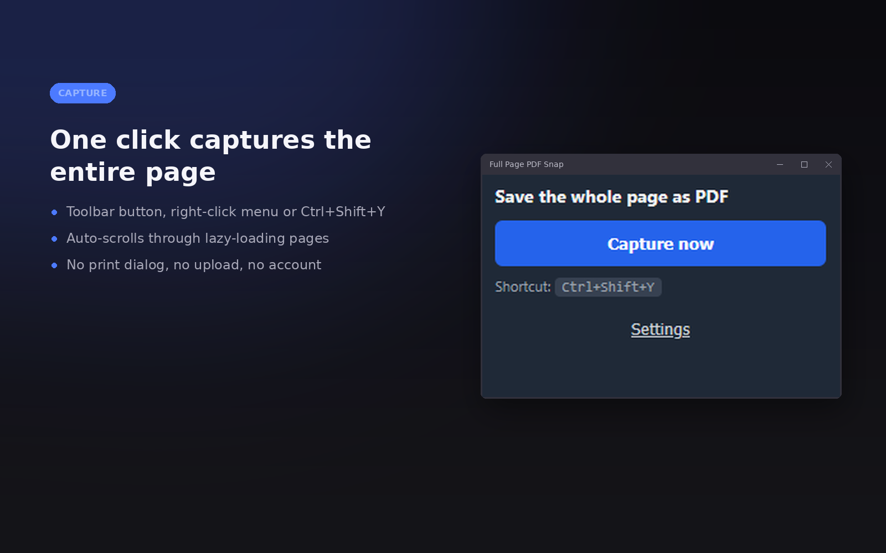
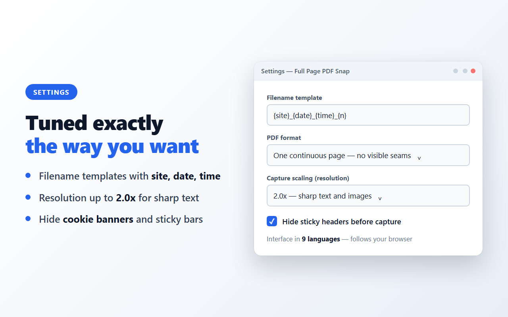
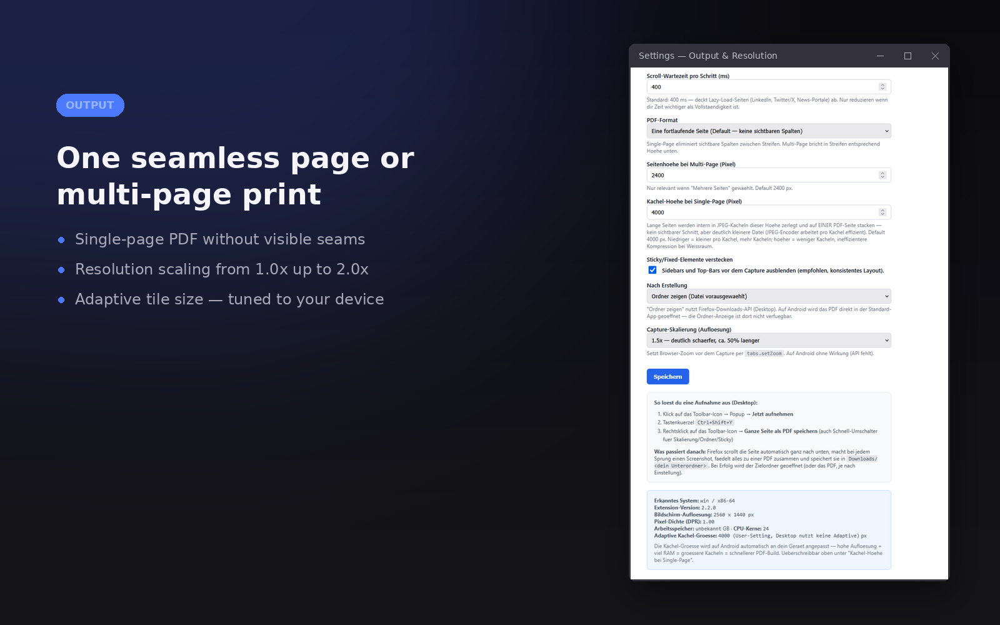

# Full Page PDF Snap — save a webpage as PDF, on desktop and Android

Save any web page as one continuous high-resolution PDF. Auto-scrolls the whole
page — no cropping, no print dialog, no upload. Runs entirely on your device:
no account, no data collection, no server. Free and MIT licensed.

*Webseite als PDF speichern — die ganze Seite, komplett lokal, ohne Konto und
ohne Upload. Läuft auch auf Firefox für Android.*

[](https://addons.mozilla.org/firefox/addon/full_page_pdf_snap_webpagesave/)
[](https://addons.mozilla.org/firefox/addon/full_page_pdf_snap_webpagesave/)
[](LICENSE)
[](manifest.json)

**[→ Install for Firefox](https://addons.mozilla.org/firefox/addon/full_page_pdf_snap_webpagesave/)**
 · [Install without a store](https://github.com/Bubu89/full-page-pdf-snap/releases/latest)
 · [Chrome package](https://github.com/Bubu89/full-page-pdf-snap/releases/latest)
 · [Product page](https://provinglab.dev/tools/full-page-pdf-snap/)



## What it is used for

Archiving an invoice, an order confirmation, a portal message, an insurance
letter or a support thread as documentation for your own records — one
continuous page, captured behind a login, because it runs in your own browser.
Web archiving before a page is edited or taken down. Feeding a long page into
OCR or a language model as a single uninterrupted sheet.

## Measured, not claimed

Independent measurements on this extension and its alternatives, with raw data
and the commands to reproduce them:

- **[How much text survives OCR?](https://provinglab.dev/measurements/webpage-to-pdf-for-ocr/)**
  — 92.6 % of the vocabulary recovered from a screenshot PDF, and the resolution
  threshold below which recognition collapses
- **[Does your PDF extension upload the page?](https://provinglab.dev/measurements/pdf-extension-permissions/)**
  — what eight capture extensions declare in their manifests
- **[Permissions as blast radius](https://provinglab.dev/measurements/extension-permissions-risk/)**
  — why permission scope matters more than trust

---

## What it does

Full Page PDF Snap scrolls the page from top to bottom, captures every viewport, and stitches all segments into one seamless PDF — entirely on your device.

- **Full-page capture** — the complete scrollable page, not just the visible part
- **Auto-scroll** — handles lazy-loading pages (LinkedIn, X/Twitter, news portals)
- **Single-page PDF** by default, with no visible seams between segments — ideal for OCR and AI tools
- **Multi-page output** optionally, for printing
- **Resolution scaling** from 1.0x to 2.0x
- **Filename templates** with site, date, time, counter and page title
- **Hide sticky elements** — cookie banners, chat widgets and top bars before capture
- **Firefox for Android** — tap the extension icon and the capture starts immediately

## Privacy

The extension has **no technical capability to collect data**. All processing — scrolling, screenshots, PDF generation, saving — happens locally in the Firefox process.

- No server of the author is ever contacted
- No analytics library, no telemetry, no error reporting
- The author never learns which pages you capture

### It cannot see the pages you browse

Most extensions in this category request `<all_urls>` — permanent read access to
every site you visit. This one does not. The full permission list from
[`manifest.json`](manifest.json):

| Permission | What it allows |
|---|---|
| `activeTab` | Read the current tab — only while you start a capture on it |
| `downloads` | Write the finished PDF to your download folder |
| `downloads.open` | Open that file afterwards, if you ask for it |
| `storage` | Keep your settings on this device |
| `menus` | The context-menu entry and its quick switches |
| `notifications` | Report that a capture finished or failed |
| `scripting` | Inject the capture script into that one tab |

No `host_permissions`, no `content_scripts` entry, and
`data_collection_permissions: ["none"]` — which is how Firefox 140+ states in the
install dialog that nothing is collected.

The single `fetch()` in the source reads a `data:` URL to turn the finished PDF
into a blob ([`background.js`](background.js), `dataUrlToBlob`). It is not a
network call; there is no other one anywhere in the code.

The full source is in this repository under the MIT license, so you can verify all of the above.

## How to use it

**Desktop**

- Click the toolbar icon → **Capture now**
- Press `Alt+Shift+Y`
- Right-click the toolbar icon → **Save entire page as PDF** (also offers quick switches for scaling, folder and sticky handling)

**Android**

Open the menu, tap the extension — the capture starts immediately without an intermediate popup. Nothing reports progress while it runs; a single notification appears once the PDF is ready.

Tapping that notification opens the result page: a preview of the whole capture, with **Download** and **Share** side by side above it. Share hands the PDF to another app — mail, a messenger, cloud storage. Firefox does not yet pass files to the system share sheet ([`files` is unimplemented](https://developer.mozilla.org/en-US/docs/Web/API/Navigator/share#browser_compatibility)), so there the button opens the app chooser instead; in Chrome the share sheet appears directly. Either way the file is already in your download folder.



## Default settings

| Setting | Desktop | Android |
|---|---|---|
| JPEG quality | 0.92 | 0.92 |
| Scroll delay | 400 ms | 400 ms |
| PDF format | Single page | Single page |
| Tile height | 4000 px | 2000 px |
| Hide sticky elements | On | On |
| After capture | Show folder | Open PDF |
| Capture scaling | 1.5x | 1.0x |



## Support

Found a bug or missing a feature? **[Open an issue](../../issues)** — please include your Firefox version, operating system, and the page where it happened.

## Building from source

```bash
web-ext lint
web-ext build --overwrite-dest
```

Requires [web-ext](https://extensionworkshop.com/documentation/develop/getting-started-with-web-ext/). Signed builds are distributed through addons.mozilla.org.

## License

MIT — see [LICENSE](LICENSE).

---

# Deutsch

Speichert eine komplette Webseite als hochauflösendes PDF. Auto-Scroll erfasst die ganze Seite — kein Zuschneiden, kein Druckdialog, kein Upload.

## Funktionen

- **Vollseiten-Erfassung** — die komplette scrollbare Seite, nicht nur der sichtbare Teil
- **Auto-Scroll** — erfasst auch Lazy-Load-Seiten (LinkedIn, X/Twitter, Nachrichtenportale)
- **Single-Page-PDF** als Standard, ohne sichtbare Schnittkanten zwischen den Streifen
- **Mehrseitige Ausgabe** optional, zum Drucken
- **Auflösung skalierbar** von 1.0x bis 2.0x
- **Dateinamen-Vorlage** mit Seite, Datum, Uhrzeit, Zähler und Seitentitel
- **Sticky-Elemente ausblenden** — Cookie-Banner, Chat-Widgets und Top-Leisten vor der Aufnahme
- **Firefox für Android** — Antippen des Symbols startet die Aufnahme sofort

## Datenschutz

Die Erweiterung enthält **technisch keine Funktion zur Datenerhebung**. Die gesamte Verarbeitung findet lokal im Firefox-Prozess statt: kein Server des Autors wird kontaktiert, keine Analytics, keine Telemetrie. Der Autor erfährt zu keinem Zeitpunkt, welche Seiten erfasst werden. Der Quellcode liegt vollständig in diesem Repository (MIT-Lizenz) und ist überprüfbar.

Vor allem aber: Die Erweiterung **sieht die Seiten nicht, die Sie besuchen**. Die
meisten Erweiterungen dieser Kategorie verlangen `<all_urls>` — dauerhaften
Lesezugriff auf jede Website. Diese nicht. Sie kommt mit `activeTab` aus, also
Zugriff auf genau den einen Tab, und das nur in dem Moment, in dem Sie dort eine
Aufnahme starten. Keine `host_permissions`, kein `content_scripts`-Eintrag. Die
vollständige Liste steht oben im englischen Teil und in
[`manifest.json`](manifest.json).

## Auslösen

- **Desktop:** Toolbar-Icon → **Jetzt aufnehmen**, Tastenkürzel `Alt+Shift+Y`, oder Rechtsklick auf das Toolbar-Icon
- **Android:** Menü → Erweiterung antippen, die Aufnahme startet sofort. Während
  der Aufnahme meldet sich nichts; erst wenn das PDF fertig ist, kommt eine
  einzige Benachrichtigung. Ein Tippen darauf öffnet die Ergebnisseite: eine
  Vorschau der ganzen Aufnahme, darüber nebeneinander **Herunterladen** und
  **Weiterleiten** — an Mail, Messenger oder Cloud-Speicher. Firefox übergibt
  Dateien noch nicht an das Teilen-Menü des Systems, dort öffnet der Knopf
  stattdessen die App-Auswahl; in Chrome erscheint das Teilen-Menü direkt.
  Gespeichert ist die Datei ohnehin schon.

## Support

Fehler gefunden oder Funktion vermisst? **[Issue eröffnen](../../issues)** — bitte Firefox-Version, Betriebssystem und die betroffene Seite angeben.
